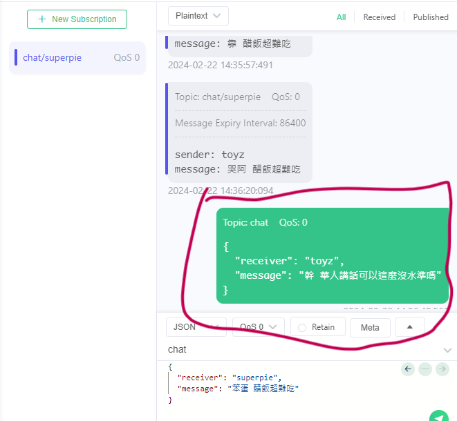
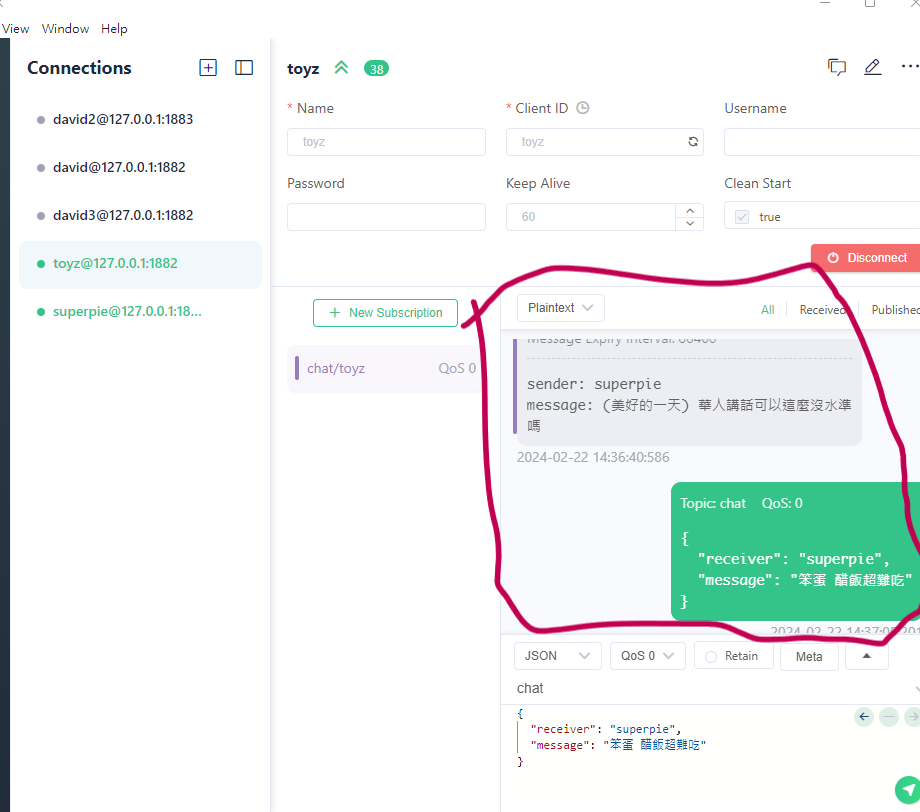
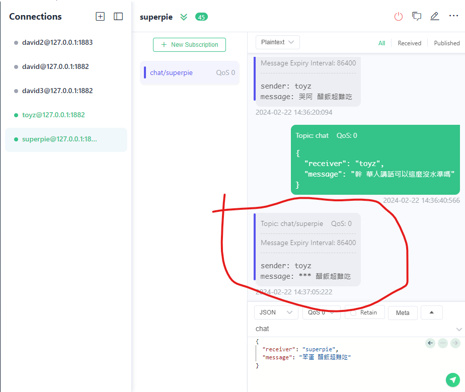
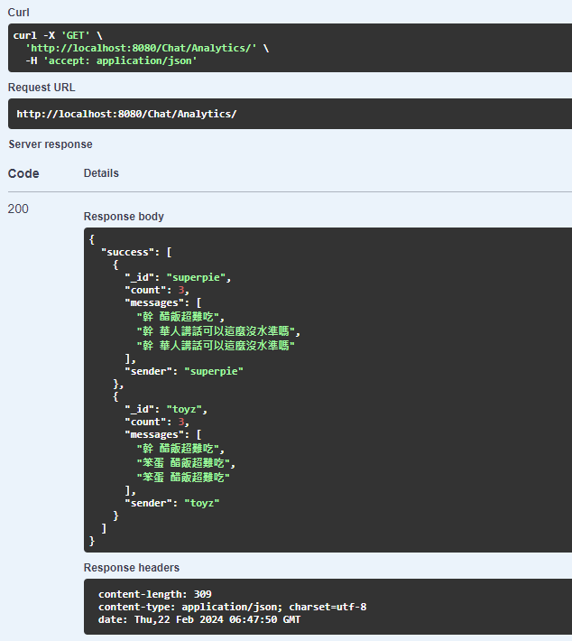

# 新人測試 MQTT + MongoDB 基本操作

## 主要內容

使用 golang + gin + mongodb + mqtt 來製作一個聊天應用程式，其中可將敏感詞進行替換。
聊天介面則使用 mqttx

## 啟動

- `使用 go run .`
- `http://localhost:8080/swagger/index.html` 可觀看基本可使用 API
- 請先確認 mongodb 連線，預設為 `localhost:27017`

## 注意

- `apply_to` 目前只對 all 有反應，因此使用 all + 敏感詞即可。

## 範例

- 先建立敏感詞 `http://localhost:8080/ChatAddSensativeWord/`，post body example

```json
{
  "apply_to": "all",
  "policy": "replace",
  "replacement": "(美好的一天)",
  "sensative_words": "幹"
}
```

- 在建立敏感詞 `http://localhost:8080/ChatAddSensativeWord/`，post body example

```json
{
  "apply_to": "all",
  "policy": "obfuscate",
  "sensative_words": "笨蛋"
}
```

- 進行 mqttx，其中在連線時採用 websocket，預設為 `127.0.0.1:1882`，且必須訂閱一個 channel，格式為 `chat/{your client_id}`
- 聊天對話如下:
  
  
  
- 再來分析結果如下
  

## 備註

- 如果有遇到問題，請你在 Issue 問我
- 這是一個簡單的專案，不一定讓你很喜歡，對不起
